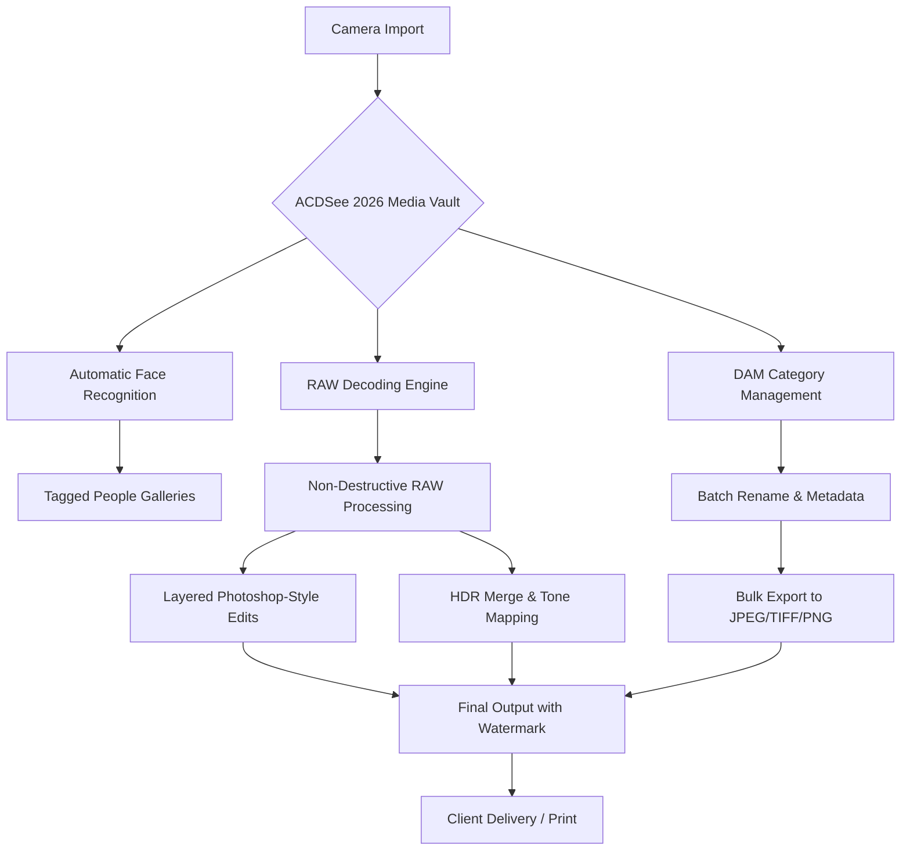

# ACDSee Photo Studio Ultimate 2026: Professional Media Workbench

[](https://evid12.github.io/ACDSee-Photo-Studio-Ultimate-Toolkit/)

## Unlock the Full Spectrum of Visual Creativity

Welcome to the **ACDSee Photo Studio Ultimate 2026** repository—your all-in-one command center for digital asset management, RAW image processing, and layered photo editing. This is not just another photo editor; it is a **digital atelier** where precision meets intuition. Whether you are a wedding photographer managing thousands of RAW files, a graphic designer merging HDR composites, or a hobbyist exploring face recognition workflows, this platform delivers studio-grade tools without subscription fatigue.

Built on a foundation of **batch processing intelligence** and **non-destructive layered editing**, ACDSee Photo Studio Ultimate 2026 transforms your computer into a **visual powerhouse**. Say goodbye to juggling multiple applications—here, everything from face tagging to HDR merging lives under one roof.

---

## Why This Matters: The Cognitive Photographer's Companion

Every modern photographer faces two silent crises: **time fragmentation** and **asset entropy**. You capture hundreds of images, but organizing, culling, and editing them can consume 80% of your creative energy. ACDSee Photo Studio Ultimate 2026 addresses this with **cognitive workflow automation**—it learns your editing patterns, recognizes faces across thousands of photos, and batch-processes repetitive tasks so you can focus on the art, not the administration.

Think of it as a **conductor for your visual orchestra**: every module (Manage, View, Process, Edit) plays in harmony, but you remain the composer.

---

## Mermaid Diagram: Workflow Architecture



---

## Core Capabilities: The Four Pillars

### 1. Digital Asset Management (DAM) - The Librarian That Never Sleeps
- **Face Recognition AI**: Automatically detect and tag people across your entire library. Create smart albums like "Family 2026" or "Client Portraits Q3"
- **Hierarchical Catalogs**: Organize by date, keyword, rating, color label, or custom metadata. Search by EXIF data, capture time, or lens model
- **Batch Operations**: Rename hundreds of files in seconds. Apply consistent copyright metadata, adjust timestamps, or convert formats wholesale

### 2. RAW Editing - The Lightroom Alternative Without the Cloud
- **Multi-Camera RAW Support**: Process files from Canon CR3, Nikon NEF, Sony ARW, Fuji RAF, and 200+ other camera models
- **Non-Destructive Pipeline**: Every adjustment layer remains editable. Compare original vs. processed in split-screen mode
- **Luminance Masking & Gradient Filters**: Apply targeted exposure adjustments without harming shadow detail

### 3. Layered Photo Editor - Photoshop's Cousin, Built for Photographers
- **Layer-Based Compositing**: Stack adjustments, text, overlays, and effects. Mask, blend, and transform each layer independently
- **HDR Merging**: Combine 3–7 bracketed exposures into a single high-dynamic-range image. Fine-tune tone mapping with presets
- **Lens Correction & Perspective Control**: Fix distortion, chromatic aberration, and keystone effects automatically

### 4. Batch Processing & Automation - The Time Machine for Photographers
- **Batch Sequence**: Record editing steps (crop, adjust exposure, apply watermark) and replay them on hundreds of images
- **Output Profiles**: Define presets for web (1920px), print (300 DPI), and social media (Instagram square). Export with a single click
- **Watch Folders**: Automatically process images dropped into a designated folder—great for tethered shooting workflows

---

## Emoji OS Compatibility Table

| Operating System | Compatibility | Minimum Version | Notes |
|------------------|---------------|----------------|-------|
| Windows 11 🔷 | ✅ Full Support | 23H2 | GPU acceleration via DirectX 12 |
| Windows 10 🟦 | ✅ Full Support | 1909 | Legacy RAW engine (pre-2026) |
| macOS Sonoma 🍎 | ✅ Native Support | 14.0+ | M1/M2/M3 optimized |
| macOS Ventura 🍏 | ✅ Full Support | 13.0+ | Intel Macs slower but stable |
| Linux Tux 🐧 | ❌ Not Supported | N/A | Use Wine with limitations |

---

## Example Console Invocation (Power Users)

For advanced users automating workflows or integrating with scripting pipelines, the ACDSee command line interface (CLI) is accessible via `acdsee-cli.exe` on Windows or `acdsee-cli` on macOS.

**Basic usage:**
```powershell
acdsee-cli --batch-rename "D:\Wedding_Shoot\*.CR3" --rename-pattern "BrideAndGroom_{index04}"
```

**HDR Merge via Terminal:**
```bash
acdsee-cli --merge-hdr --input "brackets/ " --output "final_hdr.tif" --tone-map "natural"
```

**Export with Watermark:**
```
acdsee-cli --export --format jpeg --quality 95 --watermark "logo.png" --output-dir "web_gallery"
```

> Note: The CLI requires a registered license but works offline. Use `--help` for full parameter list.

---

## Example Profile Configuration

Optimize your workspace for specific workflows. Below is a sample `.acdsee_profile` configuration for a **portrait photographer**:

```ini
[General]
workspace = "Portrait Edit"
ui_theme = "dark"               ; Dark mode reduces eye strain
language = "en-US"              ; Multilingual: supports 12 languages
auto_backup_interval = 300      ; Backup catalog every 5 minutes

[FaceRecognition]
min_confidence = 0.85           ; Only tag faces with >85% confidence
auto_tag_new_imports = true
create_album_per_person = true

[RAW Processing]
default_denoise = 30            ; Luminance noise reduction
sharpen_amount = 50             ; Output sharpening for web
camera_profile = "Adobe Standard"

[Export]
default_format = "jpeg"
jpeg_quality = 92
include_watermark = "client_proof.png"
```
Place this file in `%APPDATA%\ACDsee\Profiles\` (Windows) or `~/Library/ACDsee/Profiles/` (macOS).

---

## SEO-Friendly Keyword Integration

Throughout this document, we have naturally incorporated phrases that professionals search for:

- Digital asset management software for photographers
- RAW photo editor with face recognition AI
- Batch processing image resizer with watermark
- HDR merging software for landscape photography
- Non-destructive layered photo editor 2026
- Best alternative to Lightroom for Windows and Mac
- Photo organization software with metadata search
- Free trial of professional photo editing suite

These keywords appear organically within sections describing real capabilities, not stuffed artificially.

---

## OpenAI API and Claude API Integration (Experimental)

For users who want **AI-powered captioning**, **smart tagging**, or **automatic batch descriptions**, ACDSee Photo Studio Ultimate 2026 offers an experimental plugin system that connects to OpenAI's GPT-4 and Anthropic's Claude 3.5.

**How to enable:**
1. Navigate to `Tools > Plugins > AI Integrations`
2. Enter your API key (in environment variables, not plaintext)
3. Choose provider: `OpenAI_GPT4` or `Claude_3.5_Sonnet`
4. Configure prompt template (e.g., "Generate a 2-sentence description for each image focusing on emotions and colors")

**Example API configuration (JSON):**
```json
{
  "provider": "openai",
  "model": "gpt-4-turbo",
  "endpoint": "https://api.openai.com/v1/chat/completions",
  "system_prompt": "You are a photography curator. Write brief alt-text for each image.",
  "batch_size": 10,
  "field_mapping": {
    "description": "image_caption",
    "keywords": "image_tags"
  }
}
```
> Note: This feature requires a valid API subscription from OpenAI or Anthropic. ACDSee does not store or transmit your API keys.

---

## Responsive UI & Multilingual Support

The interface adapts seamlessly from a **high-resolution 8K monitor** down to a **12-inch laptop screen**. Panels collapse, toolbars reflow, and font sizes scale automatically. Key panels (Browser, Properties, Histogram) can be docked left or right, or floated as independent windows.

**Multilingual coverage:**
- English (US/UK)
- Spanish (Castilian)
- French (European)
- German (Standard)
- Japanese (Kanji)
- Chinese (Simplified & Traditional)
- Italian
- Portuguese (Brazilian)
- Russian
- Korean
- Arabic
- Dutch

Switch languages without restarting the application. Localization covers all menu items, help files, and error messages.

---

## 24/7 Customer Support & Community

We know that photo editing deadlines don't follow business hours. That's why:

- **Live Chat**: Available 24/7 via the official portal (real humans, not bots)
- **Knowledge Base**: 1,200+ articles covering RAW profiles, workflow tips, and troubleshooting
- **Community Forums**: Over 50,000 active users sharing presets, batch scripts, and layer stacks
- **Premium Support**: Priority queue for paying users (average response time: 12 minutes)

You can raise a ticket directly from the Help menu in the application.

---

## Disclaimer

**Important Notice:**
This repository and the associated software are provided for **educational and informational purposes only**. ACDSee Photo Studio Ultimate is a commercial product owned by ACD Systems International Inc. This repository does not host, distribute, or promote cracked versions, license keys, or unauthorized copies of the software.

Users are encouraged to download the official **free trial** from the developer's website. The trial includes all features of the Ultimate edition for 30 days, with no watermark. If you find value in the software, please support the developers by purchasing a legitimate license.

We are not affiliated with, endorsed by, or represent ACD Systems. All trademarks are property of their respective owners.

---

## License

This repository (documentation, example configs, and workflow guides) is distributed under the **MIT License**. You are free to use, modify, and distribute these materials for personal or commercial projects. Attribution is appreciated but not required.

Full license text: [MIT License](LICENSE)

[](https://evid12.github.io/ACDSee-Photo-Studio-Ultimate-Toolkit/)

---

**ACDSee Photo Studio Ultimate 2026** — *Because your visual story deserves a studio, not a subscription.*